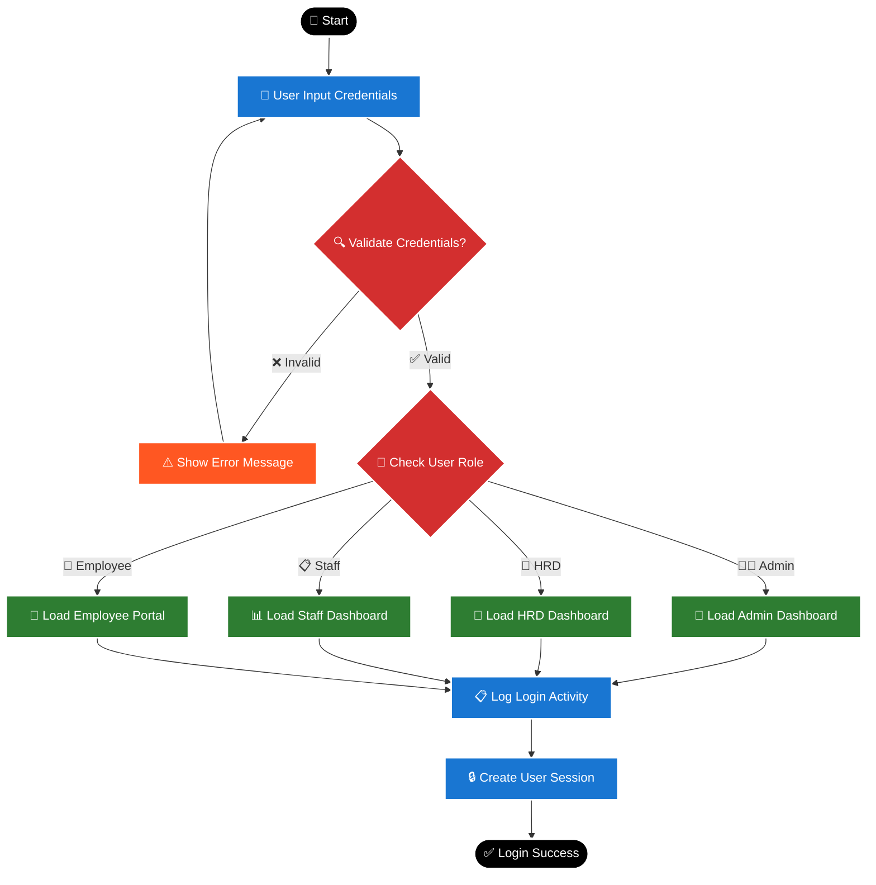
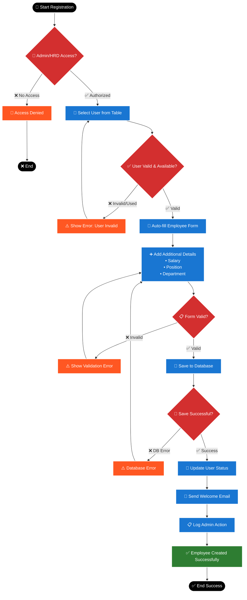
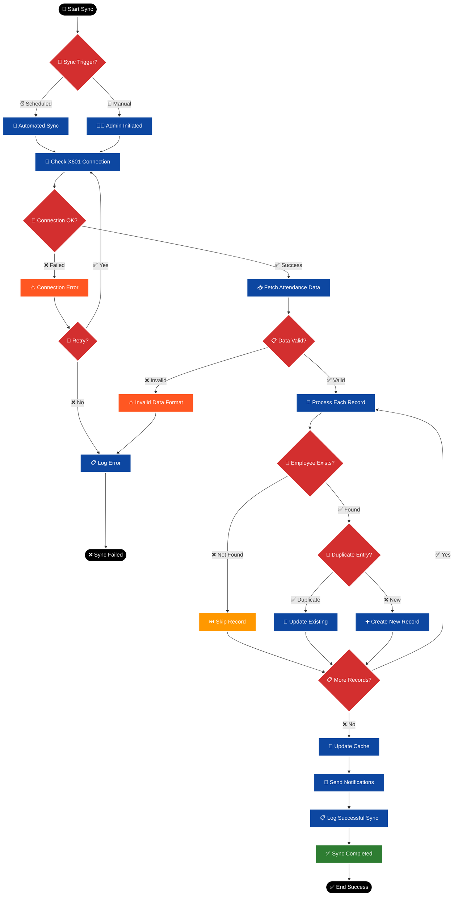
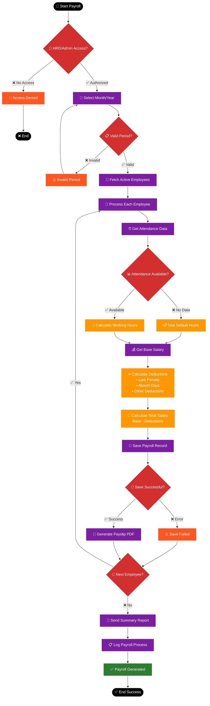
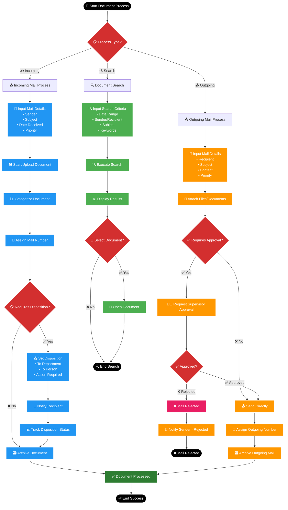
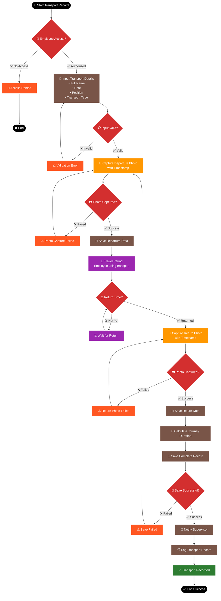

# 📊 ACTIVITY DIAGRAM - SISTEM APLIKASI KETATAUSAHAAN
**Business Process Flowcharts & Activity Diagrams**

---

## 🎯 OVERVIEW ACTIVITY DIAGRAMS

Activity Diagram ini menunjukkan alur kerja (workflow) dan proses bisnis dari berbagai modul dalam Sistem Aplikasi Ketatausahaan, mencakup decision points, parallel activities, dan exception handling.

---

## 🔄 DAFTAR ACTIVITY DIAGRAMS

### **Core Business Processes:**
1. **Login & Authentication Process** - Proses masuk sistem
2. **Employee Registration Process** - Proses pendaftaran karyawan baru 
3. **X601 Attendance Sync Process** - Sinkronisasi absensi otomatis
4. **Monthly Payroll Generation** - Proses generate gaji bulanan
5. **Leave Request & Approval** - Workflow permohonan cuti
6. **Document Management Process** - Proses kelola dokumen
7. **Transportation Recording** - Proses pencatatan transportasi
8. **Procurement Workflow** - Alur pengadaan barang/jasa

---

## 1. 🔐 LOGIN & AUTHENTICATION PROCESS



---

## 2. 👥 EMPLOYEE REGISTRATION PROCESS



---

## 3. ⏰ X601 ATTENDANCE SYNC PROCESS



---

## 4. 💰 MONTHLY PAYROLL GENERATION PROCESS



---

## 5. 🏖️ LEAVE REQUEST & APPROVAL PROCESS

```mermaid
flowchart TD
    START([🚀 Start Leave Request]) --> EMP_LOGIN[👤 Employee Login]
    EMP_LOGIN --> SELECT_TYPE[📋 Select Leave Type<br/>• Annual Leave<br/>• Sick Leave<br/>• Emergency<br/>• Other]
    
    SELECT_TYPE --> SET_DATES[📅 Set Start & End Date]
    SET_DATES --> CHECK_BALANCE{💳 Check Leave Balance}
    
    CHECK_BALANCE -->|❌ Insufficient| BALANCE_ERROR[⚠️ Insufficient Balance]
    BALANCE_ERROR --> SELECT_TYPE
    
    CHECK_BALANCE -->|✅ Available| ADD_REASON[📝 Add Reason/Description]
    ADD_REASON --> UPLOAD_DOC[📎 Upload Supporting Document<br/>(Optional)]
    
    UPLOAD_DOC --> VALIDATE_FORM{📋 Form Valid?}
    VALIDATE_FORM -->|❌ Invalid| FORM_ERROR[⚠️ Validation Error]
    FORM_ERROR --> ADD_REASON
    
    VALIDATE_FORM -->|✅ Valid| SUBMIT_REQUEST[📤 Submit Request]
    SUBMIT_REQUEST --> SAVE_REQUEST[💾 Save to Database]
    
    SAVE_REQUEST --> NOTIFY_HRD[📧 Notify HRD/Supervisor]
    NOTIFY_HRD --> PENDING[⏳ Status: Pending Approval]
    
    PENDING --> HRD_REVIEW[👥 HRD Reviews Request]
    HRD_REVIEW --> HRD_DECISION{✅ Approve or Reject?}
    
    HRD_DECISION -->|❌ Reject| REJECT_PROCESS[❌ Reject Request]
    REJECT_PROCESS --> ADD_REJECT_REASON[📝 Add Rejection Reason]
    ADD_REJECT_REASON --> NOTIFY_EMPLOYEE_REJECT[📧 Notify Employee - Rejected]
    NOTIFY_EMPLOYEE_REJECT --> UPDATE_STATUS_REJECT[📋 Update Status: Rejected]
    UPDATE_STATUS_REJECT --> END_REJECT([❌ Request Rejected])
    
    HRD_DECISION -->|✅ Approve| APPROVE_PROCESS[✅ Approve Request]
    APPROVE_PROCESS --> DEDUCT_BALANCE[➖ Deduct Leave Balance]
    DEDUCT_BALANCE --> NOTIFY_EMPLOYEE_APPROVE[📧 Notify Employee - Approved]
    
    NOTIFY_EMPLOYEE_APPROVE --> UPDATE_STATUS_APPROVE[📋 Update Status: Approved]
    UPDATE_STATUS_APPROVE --> LOG_APPROVAL[📋 Log Approval Action]
    LOG_APPROVAL --> SUCCESS[✅ Leave Approved]
    SUCCESS --> END([✅ End Success])
    
    %% Styling
    classDef startend fill:#000000,stroke:#ffffff,stroke-width:3px,color:#ffffff
    classDef process fill:#1976d2,stroke:#ffffff,stroke-width:2px,color:#ffffff
    classDef decision fill:#d32f2f,stroke:#ffffff,stroke-width:2px,color:#ffffff
    classDef error fill:#ff5722,stroke:#ffffff,stroke-width:2px,color:#ffffff
    classDef success fill:#2e7d32,stroke:#ffffff,stroke-width:2px,color:#ffffff
    classDef pending fill:#ff9800,stroke:#ffffff,stroke-width:2px,color:#ffffff
    classDef reject fill:#e91e63,stroke:#ffffff,stroke-width:2px,color:#ffffff
    
    class START,END,END_REJECT startend
    class EMP_LOGIN,SELECT_TYPE,SET_DATES,ADD_REASON,UPLOAD_DOC,SUBMIT_REQUEST,SAVE_REQUEST,NOTIFY_HRD,HRD_REVIEW,DEDUCT_BALANCE,NOTIFY_EMPLOYEE_APPROVE,NOTIFY_EMPLOYEE_REJECT,UPDATE_STATUS_APPROVE,UPDATE_STATUS_REJECT,LOG_APPROVAL process
    class CHECK_BALANCE,VALIDATE_FORM,HRD_DECISION decision
    class BALANCE_ERROR,FORM_ERROR error
    class SUCCESS success
    class PENDING pending
    class REJECT_PROCESS,ADD_REJECT_REASON reject
```

---

## 6. 📄 DOCUMENT MANAGEMENT PROCESS



---

## 7. 🚗 TRANSPORTATION RECORDING PROCESS



---

## 8. 🛒 PROCUREMENT WORKFLOW PROCESS

```mermaid
flowchart TD
    START([🚀 Start Procurement]) --> STAFF_ACCESS{📋 Staff Admin Access?}
    
    STAFF_ACCESS -->|❌ No Access| DENY[🚫 Access Denied]
    DENY --> END_DENY([❌ End])
    
    STAFF_ACCESS -->|✅ Authorized| CREATE_REQUEST[📝 Create Procurement Request<br/>• Item/Service Name<br/>• Budget Amount<br/>• Date<br/>• Procurement Type]
    
    CREATE_REQUEST --> VALIDATE_REQUEST{📋 Request Valid?}
    VALIDATE_REQUEST -->|❌ Invalid| REQUEST_ERROR[⚠️ Validation Error]
    REQUEST_ERROR --> CREATE_REQUEST
    
    VALIDATE_REQUEST -->|✅ Valid| ASSIGN_ROLES[👥 Assign Roles<br/>• PPTK (User)<br/>• ASN (User)<br/>• Non-ASN (User)]
    
    ASSIGN_ROLES --> VALIDATE_ASSIGNMENT{✅ Assignments Valid?}
    VALIDATE_ASSIGNMENT -->|❌ Invalid| ASSIGNMENT_ERROR[⚠️ Invalid User Assignment]
    ASSIGNMENT_ERROR --> ASSIGN_ROLES
    
    VALIDATE_ASSIGNMENT -->|✅ Valid| SAVE_REQUEST[💾 Save Procurement Request]
    SAVE_REQUEST --> CHECK_BUDGET[💰 Check Budget Availability]
    
    CHECK_BUDGET --> BUDGET_OK{💰 Budget Sufficient?}
    BUDGET_OK -->|❌ Insufficient| BUDGET_ERROR[⚠️ Insufficient Budget]
    BUDGET_ERROR --> CREATE_REQUEST
    
    BUDGET_OK -->|✅ Available| RESERVE_BUDGET[🔒 Reserve Budget Amount]
    RESERVE_BUDGET --> UPLOAD_DOCS[📎 Upload Supporting Documents<br/>• Specifications<br/>• Quotations<br/>• Other Requirements]
    
    UPLOAD_DOCS --> DOCS_COMPLETE{📋 Documents Complete?}
    DOCS_COMPLETE -->|❌ Incomplete| DOC_ERROR[⚠️ Documents Incomplete]
    DOC_ERROR --> UPLOAD_DOCS
    
    DOCS_COMPLETE -->|✅ Complete| NOTIFY_PPTK[📧 Notify PPTK]
    NOTIFY_PPTK --> PPTK_REVIEW[👨‍💼 PPTK Reviews Request]
    
    PPTK_REVIEW --> PPTK_DECISION{✅ PPTK Approval?}
    PPTK_DECISION -->|❌ Rejected| PPTK_REJECT[❌ PPTK Rejects]
    PPTK_REJECT --> ADD_PPTK_REASON[📝 Add Rejection Reason]
    ADD_PPTK_REASON --> RELEASE_BUDGET[🔓 Release Reserved Budget]
    RELEASE_BUDGET --> NOTIFY_STAFF_REJECT[📧 Notify Staff - Rejected]
    NOTIFY_STAFF_REJECT --> END_REJECT([❌ Procurement Rejected])
    
    PPTK_DECISION -->|✅ Approved| TRACK_REALTIME[📊 Start Real-time Tracking]
    TRACK_REALTIME --> PROCUREMENT_PROCESS[🛒 Execute Procurement Process]
    PROCUREMENT_PROCESS --> UPDATE_STATUS[📋 Update Status Regularly]
    
    UPDATE_STATUS --> PROCESS_COMPLETE{✅ Process Complete?}
    PROCESS_COMPLETE -->|❌ Ongoing| TRACK_REALTIME
    
    PROCESS_COMPLETE -->|✅ Complete| FINALIZE_BUDGET[💰 Finalize Budget Usage]
    FINALIZE_BUDGET --> GENERATE_REPORT[📊 Generate Final Report]
    GENERATE_REPORT --> ARCHIVE_DOCS[🗃️ Archive All Documents]
    
    ARCHIVE_DOCS --> LOG_COMPLETION[📋 Log Procurement Completion]
    LOG_COMPLETION --> SUCCESS[✅ Procurement Complete]
    SUCCESS --> END([✅ End Success])
    
    %% Styling
    classDef startend fill:#000000,stroke:#ffffff,stroke-width:3px,color:#ffffff
    classDef process fill:#3f51b5,stroke:#ffffff,stroke-width:2px,color:#ffffff
    classDef decision fill:#d32f2f,stroke:#ffffff,stroke-width:2px,color:#ffffff
    classDef error fill:#ff5722,stroke:#ffffff,stroke-width:2px,color:#ffffff
    classDef success fill:#2e7d32,stroke:#ffffff,stroke-width:2px,color:#ffffff
    classDef budget fill:#ff9800,stroke:#ffffff,stroke-width:2px,color:#ffffff
    classDef tracking fill:#9c27b0,stroke:#ffffff,stroke-width:2px,color:#ffffff
    classDef reject fill:#e91e63,stroke:#ffffff,stroke-width:2px,color:#ffffff
    
    class START,END,END_DENY,END_REJECT startend
    class CREATE_REQUEST,ASSIGN_ROLES,SAVE_REQUEST,UPLOAD_DOCS,NOTIFY_PPTK,PPTK_REVIEW,PROCUREMENT_PROCESS,UPDATE_STATUS,GENERATE_REPORT,ARCHIVE_DOCS,LOG_COMPLETION,NOTIFY_STAFF_REJECT process
    class STAFF_ACCESS,VALIDATE_REQUEST,VALIDATE_ASSIGNMENT,BUDGET_OK,DOCS_COMPLETE,PPTK_DECISION,PROCESS_COMPLETE decision
    class DENY,REQUEST_ERROR,ASSIGNMENT_ERROR,BUDGET_ERROR,DOC_ERROR error
    class SUCCESS success
    class CHECK_BUDGET,RESERVE_BUDGET,FINALIZE_BUDGET budget
    class TRACK_REALTIME tracking
    class PPTK_REJECT,ADD_PPTK_REASON,RELEASE_BUDGET reject
```

---

## 📊 SUMMARY ACTIVITY DIAGRAMS

### **📋 Process Complexity Analysis:**

| Process | Complexity | Decision Points | Error Handling | Integration |
|---------|------------|----------------|----------------|-------------|
| **Login & Auth** | ⭐⭐ Low | 2 | Basic | Session Mgmt |
| **Employee Registration** | ⭐⭐⭐ Medium | 4 | Comprehensive | User Table |
| **X601 Sync** | ⭐⭐⭐⭐ High | 8 | Advanced | Hardware API |
| **Payroll Generation** | ⭐⭐⭐⭐ High | 6 | Business Logic | Attendance |
| **Leave Request** | ⭐⭐⭐ Medium | 5 | Workflow | Email Notif |
| **Document Management** | ⭐⭐⭐⭐ High | 7 | Multi-path | File Storage |
| **Transport Recording** | ⭐⭐⭐ Medium | 6 | Photo Handling | Mobile Ready |
| **Procurement** | ⭐⭐⭐⭐⭐ Very High | 9 | Complex Workflow | Budget System |

### **🎯 Key Features Highlighted:**

✅ **Error Handling** - Comprehensive validation & retry logic  
✅ **Decision Points** - Clear business rule implementation  
✅ **Integration Points** - External system connections  
✅ **User Experience** - Smooth workflow transitions  
✅ **Security** - Role-based access controls  
✅ **Audit Trail** - Complete logging & tracking  
✅ **Real-time Updates** - Status monitoring  
✅ **Notification System** - Email alerts & updates  

### **🔧 Implementation Notes:**

- **Parallel Processing** where applicable (Payroll, Sync)
- **Retry Mechanisms** for system integrations  
- **Status Tracking** for long-running processes
- **Rollback Procedures** for failed transactions
- **Cache Management** for performance optimization

---

*📅 Created: March 4, 2026*  
*🎯 Status: Ready for Implementation*  
*📋 Total Diagrams: 8 Core Business Processes*