# 📊 USE CASE DIAGRAM - SISTEM APLIKASI KETATAUSAHAAN

## 🎯 OVERVIEW USE CASE DIAGRAM

Use Case Diagram ini menggambarkan interaksi antara berbagai aktor dengan sistem aplikasi ketatausahaan, mencakup semua modul yang telah diimplementasikan.

---

## 👥 AKTOR SISTEM

### **Primary Actors:**

1. **Administrator Sistem** - Full access, sistem management
2. **Staff HRD** - Kepegawaian, payroll, attendance
3. **Staff Administrasi** - Surat menyurat, agenda, dokumen
4. **Pegawai/Karyawan** - Self-service portal
5. **Kepala Bagian** - Approval, monitoring, reporting

### **Secondary Actors:**

6. **Mesin X601** - Hardware absensi (external system)
7. **Email System** - Notification service
8. **File Storage** - Document repository

---

## 🔄 USE CASE DIAGRAM (Mermaid Format)

```mermaid
graph TB
    %% Actors
    Admin["👨‍💼 Administrator<br/>Sistem"]
    HRD["👥 Staff HRD"]
    AdminStaff["📋 Staff<br/>Administrasi"]
    Employee["👤 Pegawai/<br/>Karyawan"]
    Supervisor["👨‍💼 Kepala<br/>Bagian"]
    X601["🤖 Mesin X601"]
    EmailSys["📧 Email System"]

    %% System Boundary
    subgraph "🏢 SISTEM APLIKASI KETATAUSAHAAN"

        %% Authentication & User Management
        subgraph "🔐 Authentication & User Management"
            UC01["Login/Logout"]
            UC02["Manage User Accounts"]
            UC03["Set User Roles & Permissions"]
            UC04["Change Password"]
        end

        %% Employee Management
        subgraph "👥 Employee Management"
            UC05["Add Employee from User"]
            UC06["Update Employee Profile"]
            UC07["View Employee List"]
            UC08["Delete Employee"]
            UC09["Manage Employee Status"]
        end

        %% Attendance System
        subgraph "⏰ Attendance System"
            UC10["Sync Attendance from X601"]
            UC11["Manual Attendance Entry"]
            UC12["View Attendance History"]
            UC13["Generate Attendance Report"]
            UC14["Correct Attendance Data"]
        end

        %% Payroll System
        subgraph "💰 Payroll System"
            UC15["Generate Monthly Payroll"]
            UC16["Calculate Salary Deductions"]
            UC17["View Payslip"]
            UC18["Export Payroll Report"]
            UC19["Approve Payroll"]
        end

        %% Leave Management
        subgraph "🏖️ Leave Management"
            UC20["Request Leave"]
            UC21["Approve/Reject Leave"]
            UC22["View Leave History"]
            UC23["Check Leave Balance"]
            UC24["Generate Leave Report"]
        end

        %% Document Management
        subgraph "📄 Document Management"
            UC25["Create Incoming Mail"]
            UC26["Create Outgoing Mail"]
            UC27["Upload Documents"]
            UC28["Search Documents"]
            UC29["Document Disposition"]
            UC30["Archive Documents"]
        end

        %% Agenda Management
        subgraph "📅 Agenda Management"
            UC31["Create Meeting/Event"]
            UC32["Schedule Meeting"]
            UC33["View Calendar"]
            UC34["Send Meeting Invitation"]
            UC35["Update Meeting Status"]
        end

        %% Transportation
        subgraph "🚗 Transportation Management"
            UC36["Record Public Transport Usage"]
            UC37["Upload Transport Photos"]
            UC38["Export Transport Report"]
            UC39["View Transport History"]
        end

        %% Procurement
        subgraph "🛒 Procurement Management"
            UC40["Create Procurement Request"]
            UC41["Assign PPTK/ASN/Non-ASN"]
            UC42["Track Budget"]
            UC43["Upload Procurement Documents"]
            UC44["Generate Procurement Report"]
        end

        %% System Administration
        subgraph "⚙️ System Administration"
            UC45["Backup System Data"]
            UC46["Monitor System Performance"]
            UC47["Configure System Settings"]
            UC48["View Audit Logs"]
            UC49["Export System Reports"]
        end
    end

    %% Actor-UseCase Relationships

    %% Administrator
    Admin --> UC01
    Admin --> UC02
    Admin --> UC03
    Admin --> UC05
    Admin --> UC06
    Admin --> UC07
    Admin --> UC08
    Admin --> UC09
    Admin --> UC11
    Admin --> UC14
    Admin --> UC45
    Admin --> UC46
    Admin --> UC47
    Admin --> UC48
    Admin --> UC49

    %% HRD Staff
    HRD --> UC01
    HRD --> UC04
    HRD --> UC05
    HRD --> UC06
    HRD --> UC07
    HRD --> UC09
    HRD --> UC11
    HRD --> UC12
    HRD --> UC13
    HRD --> UC14
    HRD --> UC15
    HRD --> UC16
    HRD --> UC18
    HRD --> UC21
    HRD --> UC22
    HRD --> UC24

    %% Admin Staff
    AdminStaff --> UC01
    AdminStaff --> UC04
    AdminStaff --> UC25
    AdminStaff --> UC26
    AdminStaff --> UC27
    AdminStaff --> UC28
    AdminStaff --> UC29
    AdminStaff --> UC30
    AdminStaff --> UC31
    AdminStaff --> UC32
    AdminStaff --> UC33
    AdminStaff --> UC34
    AdminStaff --> UC35
    AdminStaff --> UC40
    AdminStaff --> UC41
    AdminStaff --> UC43
    AdminStaff --> UC44

    %% Employee
    Employee --> UC01
    Employee --> UC04
    Employee --> UC06
    Employee --> UC12
    Employee --> UC17
    Employee --> UC20
    Employee --> UC22
    Employee --> UC23
    Employee --> UC33
    Employee --> UC36
    Employee --> UC37
    Employee --> UC39

    %% Supervisor/Manager
    Supervisor --> UC01
    Supervisor --> UC04
    Supervisor --> UC13
    Supervisor --> UC18
    Supervisor --> UC19
    Supervisor --> UC21
    Supervisor --> UC24
    Supervisor --> UC35
    Supervisor --> UC38
    Supervisor --> UC44

    %% External Systems
    X601 --> UC10
    EmailSys --> UC34

    %% Includes/Extends relationships
    UC10 -.->|includes| UC12
    UC15 -.->|includes| UC12
    UC15 -.->|includes| UC16
    UC21 -.->|extends| UC34
    UC31 -.->|extends| UC34

    classDef actor fill:#e1f5fe,stroke:#01579b,stroke-width:2px
    classDef usecase fill:#f3e5f5,stroke:#4a148c,stroke-width:1px
    classDef system fill:#e8f5e8,stroke:#2e7d32,stroke-width:3px

    class Admin,HRD,AdminStaff,Employee,Supervisor,X601,EmailSys actor
```

---

## 📋 DAFTAR USE CASE DETAIL

### **🔐 Authentication & User Management**

| ID   | Use Case                     | Aktor Utama   | Deskripsi                |
| ---- | ---------------------------- | ------------- | ------------------------ |
| UC01 | Login/Logout                 | Semua User    | Masuk dan keluar sistem  |
| UC02 | Manage User Accounts         | Administrator | Kelola akun pengguna     |
| UC03 | Set User Roles & Permissions | Administrator | Atur peran dan hak akses |
| UC04 | Change Password              | Semua User    | Ubah password            |

### **👥 Employee Management**

| ID   | Use Case                | Aktor Utama          | Deskripsi                       |
| ---- | ----------------------- | -------------------- | ------------------------------- |
| UC05 | Add Employee from User  | Admin, HRD           | Tambah karyawan dari tabel user |
| UC06 | Update Employee Profile | Admin, HRD, Employee | Update profil karyawan          |
| UC07 | View Employee List      | Admin, HRD           | Lihat daftar karyawan           |
| UC08 | Delete Employee         | Administrator        | Hapus data karyawan             |
| UC09 | Manage Employee Status  | Admin, HRD           | Kelola status kepegawaian       |

### **⏰ Attendance System**

| ID   | Use Case                   | Aktor Utama       | Deskripsi                       |
| ---- | -------------------------- | ----------------- | ------------------------------- |
| UC10 | Sync Attendance from X601  | Mesin X601, Admin | Sinkronisasi dari mesin absensi |
| UC11 | Manual Attendance Entry    | Admin, HRD        | Input kehadiran manual          |
| UC12 | View Attendance History    | Employee, HRD     | Lihat riwayat kehadiran         |
| UC13 | Generate Attendance Report | HRD, Supervisor   | Generate laporan kehadiran      |
| UC14 | Correct Attendance Data    | Admin, HRD        | Koreksi data kehadiran          |

### **💰 Payroll System**

| ID   | Use Case                    | Aktor Utama     | Deskripsi                  |
| ---- | --------------------------- | --------------- | -------------------------- |
| UC15 | Generate Monthly Payroll    | HRD             | Generate slip gaji bulanan |
| UC16 | Calculate Salary Deductions | HRD             | Hitung potongan gaji       |
| UC17 | View Payslip                | Employee        | Lihat slip gaji            |
| UC18 | Export Payroll Report       | HRD, Supervisor | Export laporan payroll     |
| UC19 | Approve Payroll             | Supervisor      | Approve penggajian         |

### **🏖️ Leave Management**

| ID   | Use Case              | Aktor Utama     | Deskripsi              |
| ---- | --------------------- | --------------- | ---------------------- |
| UC20 | Request Leave         | Employee        | Ajukan permohonan cuti |
| UC21 | Approve/Reject Leave  | HRD, Supervisor | Setujui/tolak cuti     |
| UC22 | View Leave History    | Employee, HRD   | Lihat riwayat cuti     |
| UC23 | Check Leave Balance   | Employee        | Cek saldo cuti         |
| UC24 | Generate Leave Report | HRD, Supervisor | Generate laporan cuti  |

### **📄 Document Management**

| ID   | Use Case             | Aktor Utama | Deskripsi         |
| ---- | -------------------- | ----------- | ----------------- |
| UC25 | Create Incoming Mail | Staff Admin | Buat surat masuk  |
| UC26 | Create Outgoing Mail | Staff Admin | Buat surat keluar |
| UC27 | Upload Documents     | Staff Admin | Upload dokumen    |
| UC28 | Search Documents     | Staff Admin | Cari dokumen      |
| UC29 | Document Disposition | Staff Admin | Disposisi surat   |
| UC30 | Archive Documents    | Staff Admin | Arsipkan dokumen  |

### **📅 Agenda Management**

| ID   | Use Case                | Aktor Utama             | Deskripsi            |
| ---- | ----------------------- | ----------------------- | -------------------- |
| UC31 | Create Meeting/Event    | Staff Admin             | Buat rapat/acara     |
| UC32 | Schedule Meeting        | Staff Admin             | Jadwalkan rapat      |
| UC33 | View Calendar           | Employee                | Lihat kalender       |
| UC34 | Send Meeting Invitation | Staff Admin             | Kirim undangan rapat |
| UC35 | Update Meeting Status   | Staff Admin, Supervisor | Update status rapat  |

### **🚗 Transportation Management**

| ID   | Use Case                      | Aktor Utama | Deskripsi                      |
| ---- | ----------------------------- | ----------- | ------------------------------ |
| UC36 | Record Public Transport Usage | Employee    | Catat penggunaan angkutan umum |
| UC37 | Upload Transport Photos       | Employee    | Upload foto timestamp          |
| UC38 | Export Transport Report       | Supervisor  | Export laporan transportasi    |
| UC39 | View Transport History        | Employee    | Lihat riwayat transportasi     |

### **🛒 Procurement Management**

| ID   | Use Case                     | Aktor Utama             | Deskripsi                  |
| ---- | ---------------------------- | ----------------------- | -------------------------- |
| UC40 | Create Procurement Request   | Staff Admin             | Buat permintaan pengadaan  |
| UC41 | Assign PPTK/ASN/Non-ASN      | Staff Admin             | Assign peran pengadaan     |
| UC42 | Track Budget                 | Staff Admin             | Track anggaran             |
| UC43 | Upload Procurement Documents | Staff Admin             | Upload dokumen pengadaan   |
| UC44 | Generate Procurement Report  | Staff Admin, Supervisor | Generate laporan pengadaan |

### **⚙️ System Administration**

| ID   | Use Case                   | Aktor Utama   | Deskripsi               |
| ---- | -------------------------- | ------------- | ----------------------- |
| UC45 | Backup System Data         | Administrator | Backup data sistem      |
| UC46 | Monitor System Performance | Administrator | Monitor performa sistem |
| UC47 | Configure System Settings  | Administrator | Konfigurasi sistem      |
| UC48 | View Audit Logs            | Administrator | Lihat log audit         |
| UC49 | Export System Reports      | Administrator | Export laporan sistem   |

---

## 🔗 RELATIONSHIP MATRIX

### **Include Relationships:**

- UC10 (Sync X601) **includes** UC12 (View Attendance)
- UC15 (Generate Payroll) **includes** UC12 (View Attendance)
- UC15 (Generate Payroll) **includes** UC16 (Calculate Deductions)

### **Extend Relationships:**

- UC21 (Approve Leave) **extends** UC34 (Send Invitation) _[when approved]_
- UC31 (Create Meeting) **extends** UC34 (Send Invitation) _[when created]_

### **Generalization:**

- UC02, UC05, UC06, UC09 inherit from "User Management"
- UC25, UC26, UC27 inherit from "Document Management"
- UC31, UC32, UC35 inherit from "Event Management"

---

## 🎯 PRIORITAS IMPLEMENTASI

### **Fase 1 (Core Functions):**

- UC01-UC04: Authentication & User Management
- UC05-UC09: Employee Management
- UC10-UC14: Attendance System

### **Fase 2 (HR Functions):**

- UC15-UC19: Payroll System
- UC20-UC24: Leave Management

### **Fase 3 (Administrative):**

- UC25-UC30: Document Management
- UC31-UC35: Agenda Management

### **Fase 4 (Extended Features):**

- UC36-UC39: Transportation Management
- UC40-UC44: Procurement Management
- UC45-UC49: System Administration

---

## 📊 STATISTIK USE CASE

- **Total Use Cases**: 49 use cases
- **Total Aktor**: 8 aktor (5 primary, 3 secondary)
- **Modul Utama**: 9 modul fungsional
- **Kompleksitas Tinggi**: UC10, UC15, UC21, UC29
- **Frekuensi Tinggi**: UC01, UC12, UC17, UC33

---

_📅 Dibuat: 4 Maret 2026_  
_🎯 Status: Ready for Development_
